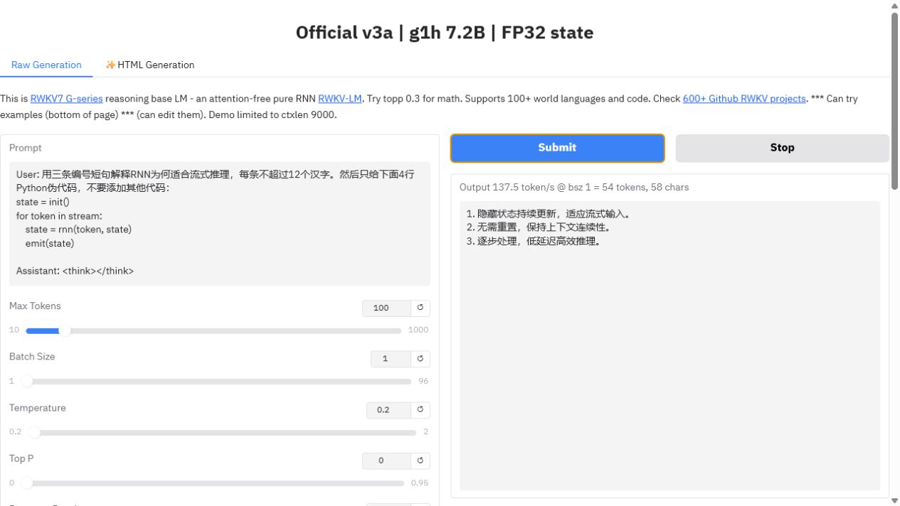

# RTX 5090 official Gradio vs Native HF browser A/B

This artifact records a real-browser comparison of the current
`BlinkDL/RWKV-Gradio-3` page at commit
`cc57df475465c6cacd42ecd4f2f05a588ee5473b`. The page, tokenizer, sampling
code, official g1h 7.2B checkpoint and FP32 recurrent-state policy are held
constant; only the model backend changes between official v3a and the
repository Native HF bridge.

## Browser result

The readable B1 prompt ended at 54 tokens on both backends. The complete output
is byte-identical:

```text
1. 隐藏状态持续更新，适应流式输入。
2. 无需重置，保持上下文连续性。
3. 逐步处理，低延迟高效推理。
```

Official v3a:



Native HF:


Both backends omitted the requested four-line pseudocode. The exact text match
passes this backend parity check, but the response itself does not fully satisfy
the instruction and is not presented as a model-quality pass.

## Speed and memory

The fixed speed prompt used 100 output tokens, temperature `0.2`, top-p `0`,
zero presence/count penalties and decay `0.99`. Each row was warmed before the
recorded run.

| Page backend | B1 tok/s | B8 tok/s | Process allocation after B1+B8 |
|---|---:|---:|---:|
| Official v3a | 137.7 | 837.7 | 14,886 MiB |
| Native HF fast-token bridge | 138.5 | 831.8 | 15,520 MiB |
| Native / official | 1.0058x | 0.9930x | 1.0426x |

Native is in the same page-level speed band, but B8 is about 0.7% below this
official run and process allocation is 634 MiB higher. This artifact therefore
does not claim that every browser shape leads or that memory parity is closed.
The stricter three-process 512-token direct-decode and logits evidence remains
[`../5090_native_decode_fused_20260718`](../5090_native_decode_fused_20260718/README.md).

B1 and B8 speed screenshots are retained under [`screenshots/`](screenshots/).
The page labels, complete quality output and environment are machine-readable in
[`results.json`](results.json) and [`environment.json`](environment.json).
Server logs and the fail-closed `HF_HUB_OFFLINE=1` startup check are under
[`raw/`](raw/).

## Implementation finding

The earlier Space bridge called full `model(...)` for every cached token, which
hid the accepted Native fast-token path. The bridge now routes one-token cached
decode through `rwkv7_forward_token(..., copy_logits=False)`. The Space patch
also reuses `APP3_HF_MODEL_PATH` during startup, so an offline Native launch does
not try to download an unrelated `.pth`. That startup-only fallback was added
after the browser A/B and then verified separately with `HF_HUB_OFFLINE=1`; the
two app hashes are recorded in `environment.json`.

This is a browser generation, interface and local throughput check. It is not a
general model-quality evaluation, a multi-user serving benchmark, or evidence
for other models, cards or sampling settings.
