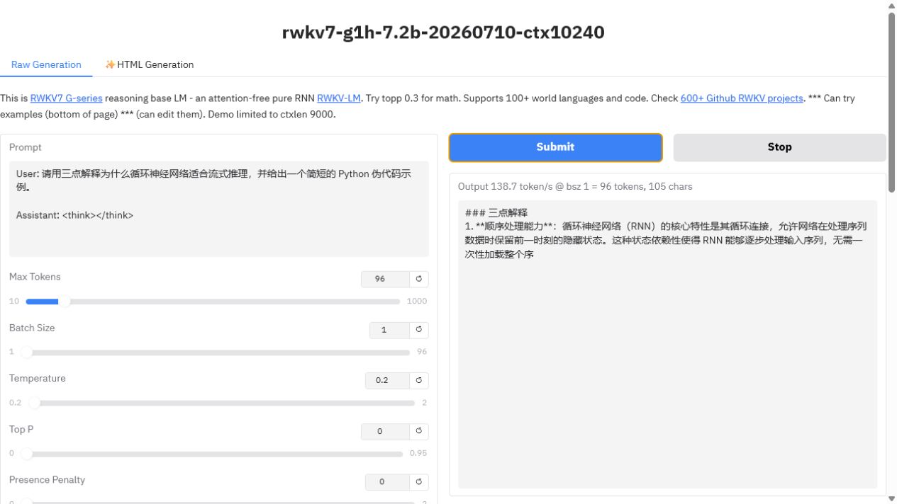
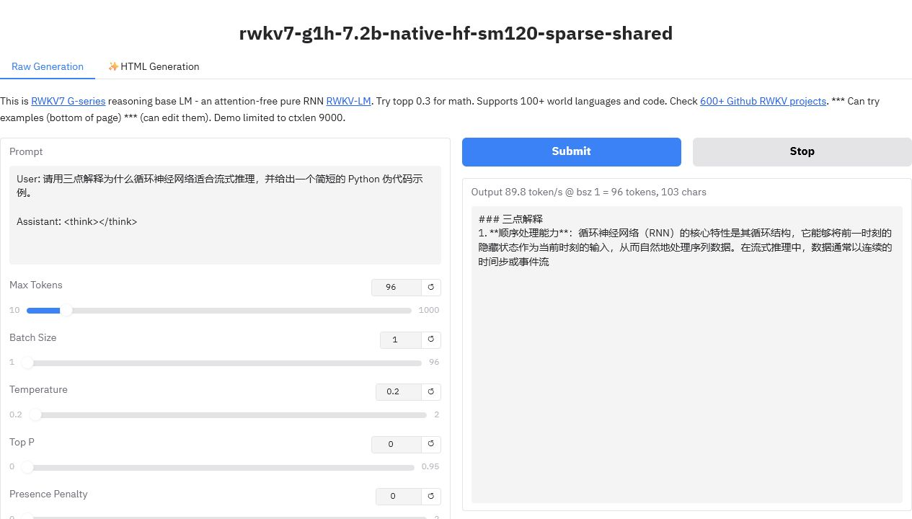

# RTX 5090 Native HF Gradio and official-shell evidence

This artifact covers two exact-card questions on one RTX 5090: whether the
official `RWKV-Gradio-3` page can generate through the repository Native HF
backend, and whether the unchanged official `train_temp` shell entry points can
run alongside the equivalent Native B16/T512/ZeRO-2 recipe.

## Pinned environment

| Item | Value |
|---|---|
| GPU | NVIDIA GeForce RTX 5090, `sm_120`, 32,607 MiB |
| Driver / PyTorch / CUDA | 595.58.03 / 2.11.0+cu128 / 12.8 |
| Transformers / Triton | 5.12.1 / 3.6.0 |
| Gradio Space | `BlinkDL/RWKV-Gradio-3` at `cc57df4` |
| Inference model | official g1h 7.2B, FP16, identical prompt and sampling |
| Official training source | RWKV-LM `e6f74b63a06e08606d130043599d218209628bad` |

Full versions and source hashes are in [`environment.json`](environment.json).

## Real browser evidence

Official v3a:



Native HF with the measured SM120 sparse profile:



Both pages generated the same deterministic answer for the recorded prompt.
This is a UI and generation smoke, not a model-quality benchmark.

## Inference result

| Backend | B1 tok/s | B8 tok/s | Process memory after graph(s) |
|---|---:|---:|---:|
| Official v3a | 138.8 | 841.7 | 14,632 / 14,888 MiB |
| Initial Native HF | 44.5 | 276.9 | 14,510 / 15,178 MiB |
| Native HF sparse, separate packs | 95.2 | 651.7 | 21,798 / 26,626 MiB |
| Native HF sparse, shared pack replay | 92.6 | 646.8 | 22,530 MiB after B1+B8 |

The Native path improved by `2.1393x` at B1 and `2.3536x` at B8 over its first
working version, but reaches only `0.6859x` and `0.7743x` of official v3a in the
best separate-pack rows. It therefore does **not** pass speed or memory parity.

The direct 48-token Native sparse probe also found only `6/8` B8 sequences
exactly matching the B1 greedy sequence for the fastest non-inplace setting;
the divergence is late at token positions 45 and 47. Earlier conservative
Native graph rows match `8/8`. SM120 sparse FFN and shared packed weights remain
independent opt-ins, not card defaults.

Raw rows are under [`gradio/`](gradio/) and
[`native_decode/`](native_decode/). `summary.json` is the compact, strict result.

## Official shell and Native training result

The official checkout ran these entry commands without editing either shell
file:

```bash
sh ./demo-training-prepare.sh
sh ./demo-training-run.sh
```

The second command was bounded to one optimizer step by a temporary `python`
PATH wrapper that only appended `--max_steps 1`. Script SHA256 values and the
exact Minipile hashes were checked first. Official output reported B16, BF16,
T512, DeepSpeed ZeRO-2, finite loss `11.20`, and `1.32 s` for the bounded step.

The equivalent Native recipe passed with loss `11.249235`, `399/399` finite
ZeRO gradient tensors, a changed model hash, 4,355.95 MiB peak memory, and
`0.7578 s` measured core runtime. The two runtimes have different harness
boundaries and are not presented as a speedup comparison.

Audit files are under [`train_temp_shell/`](train_temp_shell/). The unchanged
shell commands validate the official user entry points for this exact recipe;
one bounded step does not prove long-run convergence or distributed training.

## Reproduce

Use [`docs/GRADIO_NATIVE_HF.md`](../../docs/GRADIO_NATIVE_HF.md) for the Space
integration and [`docs/TRAIN_TEMP_CUDA.md`](../../docs/TRAIN_TEMP_CUDA.md) for
the official-shell and Native training commands. AI-assisted execution starts
only from [`docs/AI_ASSISTED_SETUP.md`](../../docs/AI_ASSISTED_SETUP.md).
