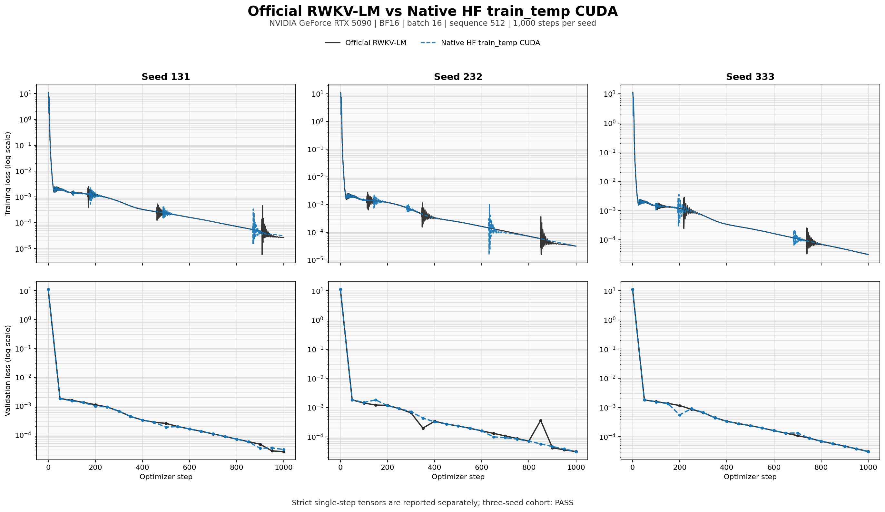

# RTX 5090 Native train_temp B16 alignment

This artifact compares the Native/no-FLA HF `train_temp_cuda` route with the
official RWKV-LM `RWKV-v7/train_temp` implementation at the actual shell
training shape: BF16, batch 16, sequence 512 and gradient checkpointing. It
closes numerical alignment, a three-seed bounded convergence cohort,
checkpoint continuity and steady-memory sampling for this exact lane.

It does not turn a synthetic sequence into a real-dataset quality claim, and
it does not claim distributed or all-card training support.

## Pinned environment

| Item | Value |
|---|---|
| GPU | NVIDIA GeForce RTX 5090, `sm_120`, 32,607 MiB |
| Driver / CUDA | 595.58.03 / PyTorch CUDA 12.8 / toolkit 12.8 |
| PyTorch / Transformers / DeepSpeed | 2.11.0+cu128 / 5.12.1 / 0.19.2 |
| Adapter code | `eabbfdf` |
| Official RWKV-LM | `e6f74b63a06e08606d130043599d218209628bad` |
| Checkpoint | L12, D768, FFN3072, vocab65536 |
| Checkpoint SHA256 | `5fcb1f16231626f0fde51c30c2d51994ef1ec80e6f737735afe83093c253b943` |
| Training shape | BF16, B16, T512, `grad_cp=1`, dense no-cache |

[`environment.json`](environment.json) records package versions, exact file
hashes, official shell hashes and the complete optimizer recipe.

## Exact tensor gate

The official checkpoint was converted once, then checked as `399/399` mapped
tensors before either backend consumed the same serialized B16 batch.

| Gate | Official | Native | Result |
|---|---:|---:|---|
| Backward loss | `11.193662643432617` | `11.193662643432617` | exact |
| Gradient tensors | 399 | 399 | cosine `1.0`, rel-L2 `0`, max-abs `0` |
| FusedAdam groups/order | official | same | exact |
| Parameter deltas | 399 | 399 | exact |
| Post-step loss | `8.379091262817383` | `8.379091262817383` | exact |
| Backward runtime | `0.4478s` | `0.5070s` | telemetry |
| Full step runtime | `0.8823s` | `0.8543s` | telemetry |

The fail-closed reports are
[`compare_backward_b16_t512.json`](compare_backward_b16_t512.json) and
[`compare_step_b16_t512.json`](compare_step_b16_t512.json). Large tensor
snapshots are intentionally omitted; their hashes and comparison results remain
in the capture and comparison JSON.

## Three-seed convergence

Seeds 131, 232 and 333 each ran 1,000 optimizer steps per backend. One run
processes 8,192,000 training tokens. Both sides use the same initial checkpoint,
serialized sequence, validation batch, FusedAdam grouping, clipping and official
learning-rate schedule.



| Metric | Official | Native HF | Comparison |
|---|---:|---:|---:|
| Finite and complete | 3/3 | 3/3 | PASS |
| Minimum validation loss `<=0.1` | 3/3 | 3/3 | equal |
| Median train-loss AUC | `0.0336931055` | `0.0336924997` | `0.001798%` relative diff |
| Median validation-loss AUC | `0.5334896262` | `0.5334765279` | `0.002455%` relative diff |
| Median maximum grad norm | `544` | `544` | `1.0x` |
| Median runtime | `82.3114s` | `86.6517s` | Native `1.0527x` runtime |
| Median training throughput | `99,524.5 tok/s` | `94,539.4 tok/s` | Native `0.9499x` |

The cohort report is
[`compare_convergence_cohort_b16_t512_s1000.json`](compare_convergence_cohort_b16_t512_s1000.json).
The Native convergence behavior passes, while training performance is still
about 5.3% below official at this shape.

The selected best-observed paired view is retained as
[`official_vs_native_best_observed.png`](official_vs_native_best_observed.png),
but it is not used in place of the full three-seed gate.

## Resume and memory stability

The short deterministic gate first proved exact continuous-versus-resumed
curves over four steps for both official and Native. The bounded long gate then
ran Native for 500 steps, atomically saved model, optimizer, Python/NumPy/torch
CPU/CUDA RNG and curve progress, and resumed to step 1,000.

| Resume gate | Result |
|---|---:|
| Model state digest restored | PASS |
| Optimizer state digest restored | PASS |
| RNG state digest restored | PASS |
| Train AUC relative diff vs continuous | `0.000719%` |
| Validation AUC relative diff | `0.001481%` |
| Final validation loss absolute diff | `7.36e-8` |
| Validation threshold step difference | `0` |

The checkpoint itself is not committed. Its file and state hashes are retained
in [`native_long_resume_partial_seed131_s500.json`](native_long_resume_partial_seed131_s500.json)
and [`native_long_resume_final_seed131_s1000.json`](native_long_resume_final_seed131_s1000.json).
The comparison is
[`compare_native_long_resume_seed131_s1000.json`](compare_native_long_resume_seed131_s1000.json).

A separate 1,000-step Native run sampled CUDA memory every 50 steps. From step
50 through 1,000, allocated memory changed by `-0.375 MiB` with a `0.375 MiB`
range; reserved memory stayed at `4,896 MiB` with zero growth. Peak allocated
memory was `3,588.48 MiB`. Raw samples are in
[`native_stability_memory_seed131_b16_t512_s1000.json`](native_stability_memory_seed131_b16_t512_s1000.json).

## Reproduce and recover

Run the CPU contract tests first:

```bash
python -m pytest -q \
  tests/test_train_temp_alignment_runner.py \
  tests/test_train_temp_cuda.py \
  tests/test_train_temp_resume.py
```

The exact process-isolated matrix is retained in [`run_b16_matrix.sh`](run_b16_matrix.sh).
Set its checkout, checkpoint and output paths for the target machine before
running it. A successful run writes `matrix_exit_code.txt` containing `0` and
all promoted comparison JSON files report `status=pass`.

Regenerate the review attachments from committed JSON:

```bash
python bench/plot_train_temp_alignment.py \
  --evidence-dir bench/5090_native_train_temp_b16_20260718 \
  --output-stem official_vs_native \
  --reference-template 'official_convergence_seed{seed}_b16_t512_s1000.json' \
  --candidate-template 'native_convergence_seed{seed}_b16_t512_s1000.json' \
  --cohort-report compare_convergence_cohort_b16_t512_s1000.json \
  --backward-report compare_backward_b16_t512.json \
  --step-report compare_step_b16_t512.json
```

For an interrupted long run, resume only from the checkpoint recorded by the
same output directory. The runner rejects changed backend, seed, checkpoint,
sequence, optimizer, schedule or gradient-checkpointing provenance. If a CUDA
extension build is interrupted, keep the matching extension cache and rerun;
if toolkit versions differ, set `CUDA_HOME` to the toolkit matching
`torch.version.cuda`.

AI-assisted execution uses the single repository entry point
[`docs/AI_ASSISTED_SETUP.md`](../../docs/AI_ASSISTED_SETUP.md) and task route
`TASK_ID=train-temp-alignment`.

## Boundary

This is an exact-card, exact-model, exact-shape synthetic alignment and bounded
stability result. Real corpora, larger checkpoints, padded or variable-length
batches, FP16/FP32, multi-GPU ZeRO, other GPUs, multi-day operation and final
model quality require separate evidence. Inference B1/B8 parity with official
RWKV-Gradio v3a is also a separate open performance lane.
