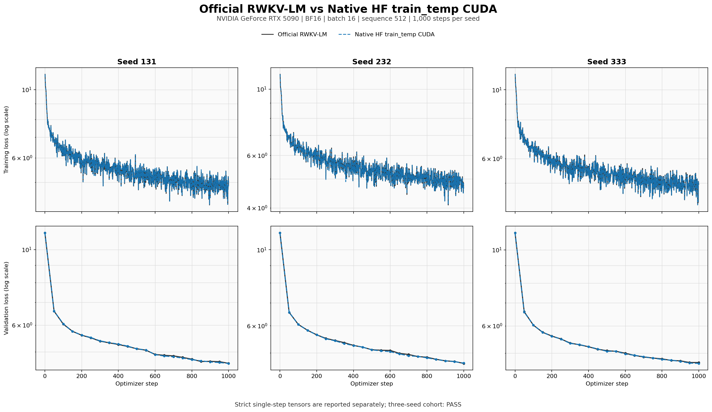
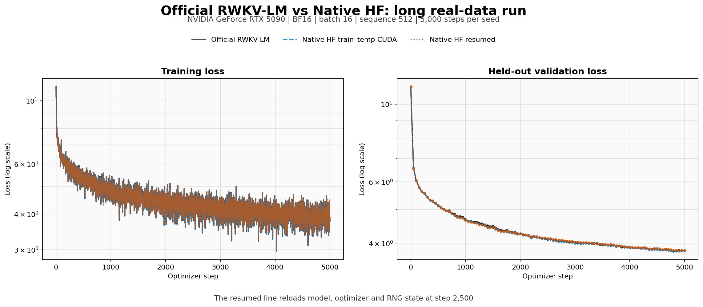

# RTX 5090 Native train_temp real-MiniPile acceptance

This artifact validates the current Native/no-FLA HF `train_temp_cuda` path
against the pinned official RWKV-LM `train_temp` implementation on real
MiniPile tokens. It covers exact post-optimization tensors, three paired seeds,
a 5,000-step run, checkpoint recovery and steady CUDA memory. It does not make
a multi-GPU or larger-model training claim.

## Pinned contract

| Item | Value |
|---|---|
| GPU | RTX 5090, SM120, 32,607 MiB, driver 595.58.03 |
| Runtime | PyTorch 2.11.0+cu128, Transformers 5.12.1, DeepSpeed 0.19.2 |
| Official source | `e6f74b63a06e08606d130043599d218209628bad` |
| Model | 12 layers, hidden 768, FFN 3072, BF16, B16/T512 |
| Checkpoint SHA256 | `5fcb1f16231626f0fde51c30c2d51994ef1ec80e6f737735afe83093c253b943` |
| MiniPile `.bin` SHA256 | `9917a52991b9ce5b0b05f92101962ba704cf3c4c20b64431ff8c45ba9d4141a5` |
| MiniPile `.idx` SHA256 | `f526abddaa06d376443e69c9a6c0fcbe4302afc0cb1aed08faf3fb97fc5acd10` |
| Sampler | official cubic sampler, magic prime `2926181` |

[`environment.json`](environment.json) records the exact package versions,
source hashes, checkpoint hash and dataset hashes. The train epochs and held-out
epoch are recorded by the `train_epoch*.json` and `validation_epoch100.json`
metadata files.

## Exact tensor gate

The final direct-Layer checkpoint boundary and standard HF tuple-output path
were rechecked after the performance change. Backward and optimizer-step
captures both pass:

| Gate | Result |
|---|---:|
| Backward loss | exact, `11.193662643432617` |
| Gradient tensors | `399/399`, cosine `1.0`, relative L2 `0` |
| Parameter deltas | `399/399`, exact |
| Post-step loss | exact, relative difference `0` |

See [`post_opt_tensor_alignment/compare_backward.json`](post_opt_tensor_alignment/compare_backward.json)
and [`post_opt_tensor_alignment/compare_step.json`](post_opt_tensor_alignment/compare_step.json).

## Three paired seeds

Each seed runs the official backend immediately followed by Native on the same
serialized real-token sequence. The strict cohort requires Native median
throughput to be at least the official median.



| Metric | Official | Native HF | Result |
|---|---:|---:|---:|
| Complete finite runs | 3/3 | 3/3 | PASS |
| Final validation loss `<=5.0` | 3/3 | 3/3 | PASS |
| Median train-loss AUC | `5.542998` | `5.538652` | `0.0784%` diff |
| Median validation-loss AUC | `5.482218` | `5.476576` | `0.1029%` diff |
| Median runtime | `82.1736s` | `82.1334s` | Native `1.00049x` throughput |
| Gradient p99.9 | `137` | `202` | `1.4745x`, below the `2x` gate |

The official CUDA training route is not bitwise deterministic over long runs.
Isolated pre-clip maxima are therefore retained as telemetry, while the hard
stability gate uses p99.9. In this cohort the median raw maximum ratio is
`6.037x`; all such points are finite, clipped to the shared `1.0` update norm,
and do not replace the p99.9, loss or validation gates. The machine decision is
[`cohort_paired_strict_s1000.json`](cohort_paired_strict_s1000.json).

## Long run and recovery



The optimized Native continuous run takes `410.414s` versus official
`411.462s`, or `1.00255x` throughput. Train-loss AUC differs by `0.0953%`,
validation-loss AUC by `0.2200%`, and final validation loss by `0.00873`.
Native finishes at `3.80373` and reaches a minimum of `3.78733`.

The interrupted run saves at step 2,500 and resumes to step 5,000. Model,
optimizer and Python/NumPy/torch CPU/CUDA RNG digests all restore successfully.
Against the uninterrupted Native run, train-loss AUC differs by `0.1231%`,
validation-loss AUC by `0.2421%`, and final validation loss by `0.01074`.
Threshold crossing differs by one `eval_interval=50` observation. Accumulated
runtime is `411.147s`; allocated memory changes by `-1.375 MiB` and reserved
memory by `-188 MiB` across the recorded steady window.

The continuous and recovery decisions are
[`compare_opt_epoch3_seed444_s5000.json`](compare_opt_epoch3_seed444_s5000.json)
and
[`compare_native_opt_epoch3_seed444_resume_s5000.json`](compare_native_opt_epoch3_seed444_resume_s5000.json).

## Reproduce and recover

Run the focused local contracts first:

```bash
python -m pytest -q tests/test_train_temp_alignment_runner.py tests/test_train_temp_cuda.py
```

On a matching CUDA machine, adjust only the absolute checkout, model and
dataset paths in [`run_paired_multiseed.sh`](run_paired_multiseed.sh),
[`run_long_opt_s5000.sh`](run_long_opt_s5000.sh) and
[`run_post_opt_tensor_alignment.sh`](run_post_opt_tensor_alignment.sh). A pass
requires `paired_strict_exit_code.txt=0`, `long_opt_exit_code.txt=0`, both
post-optimization tensor reports to pass, three complete seeds, median
throughput `>=1.0x`, p99.9 gradient ratio `<=2x`, and successful state restore.

If interrupted, keep the `.safetensors` sequence and the atomic `.pt`
checkpoint in the same evidence directory, then rerun only the resume command
with the recorded `--resume-from` path. The runner rejects changed checkpoint,
dataset, optimizer, schedule, seed or gradient-checkpointing provenance. CUDA
extension failures should be recovered by fixing the PyTorch/CUDA toolchain and
reusing the matching `TORCH_EXTENSIONS_DIR`; do not merge results from another
card.

AI-assisted execution uses the single repository entry point
[`docs/AI_ASSISTED_SETUP.md`](../../docs/AI_ASSISTED_SETUP.md) and task route
`TASK_ID=train-temp-alignment`.

## Boundary

This is exact RTX 5090 evidence for the official 12x768 B16/T512 recipe and
real MiniPile slices. It validates the current Native HF backend at this shape;
it does not prove padded batches, another model size, another precision,
multi-day final quality, or new ZeRO-2/ZeRO-3 hardware coverage. Existing
multi-GPU evidence remains separately card-scoped.
