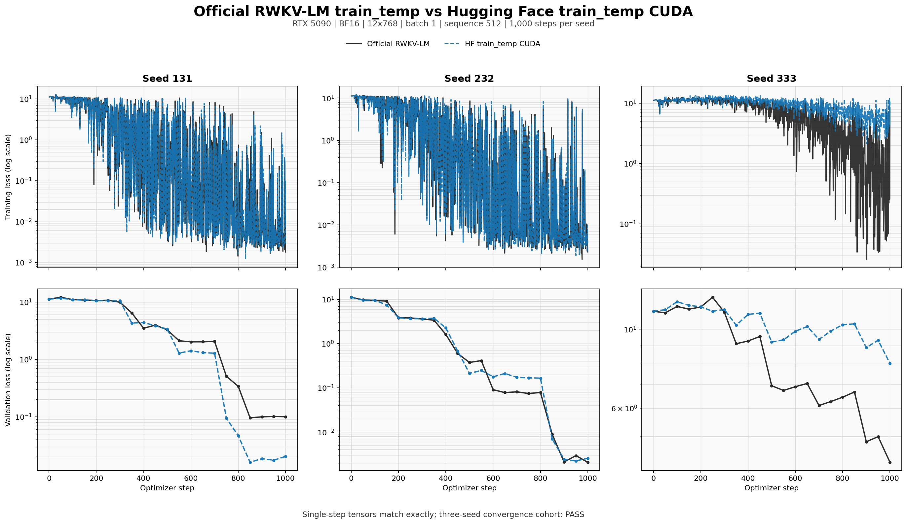

# RTX 5090 train_temp alignment evidence

This artifact compares the opt-in HF `train_temp_cuda` backend against the
official RWKV-LM `RWKV-v7/train_temp` implementation on one RTX 5090. It tests
training math and convergence behavior; it is not a Trainer-interface smoke or
a multi-GPU claim.

## Pinned scope

| Item | Value |
|---|---|
| GPU | NVIDIA GeForce RTX 5090, `sm_120`, 32,607 MiB |
| Driver / toolkit | 595.58.03 / CUDA 12.8 |
| PyTorch / DeepSpeed | 2.11.0+cu128 / 0.19.2 |
| Official RWKV-LM | `e6f74b63a06e08606d130043599d218209628bad` |
| Checkpoint | 12 layers, D768, FFN3072, vocab65536, 191,084,544 parameters |
| Checkpoint SHA256 | `5fcb1f16231626f0fde51c30c2d51994ef1ec80e6f737735afe83093c253b943` |
| Training shape | BF16, batch 1, sequence 512, dense no-cache |

The complete environment is in [`environment.json`](environment.json). The
vendored CUDA operators retain the official Apache-2.0 license and source
commit under `rwkv7_hf/csrc/train_temp/`.

## Results



Downloadable review tables:
[`official_vs_hf_single_step.csv`](official_vs_hf_single_step.csv) and
[`official_vs_hf_cohort.csv`](official_vs_hf_cohort.csv). These are generated
directly from the committed comparison JSON rather than copied from a separate
spreadsheet.

### Strict single-step contract

| Gate | Result |
|---|---:|
| CUDA extension compile/link/register | PASS, exit `0` |
| Backward loss | exact, `11.18958568572998` |
| Backward gradients | 400/400 tensors, cosine `1.0`, relative L2 `0`, max abs `0` |
| FusedAdam grouping and order | exact |
| Optimizer step | 401 gated tensors plus 399 deltas, all exact |
| Post-step loss | exact, `8.01020622253418` |

The strict reports are [`compare_backward.json`](compare_backward.json) and
[`compare_step.json`](compare_step.json). Large intermediate safetensors are
not committed; their hashes, tensor counts and comparison outputs are retained
in the JSON reports.

### Three-seed convergence contract

Each backend ran 1,000 steps for seeds 131, 232 and 333 with the same initial
checkpoint, serialized sample sequence, validation batch, FusedAdam recipe and
learning-rate schedule.

| Metric | Official | HF train_temp CUDA | Comparison |
|---|---:|---:|---:|
| Runs finite and complete | 3/3 | 3/3 | PASS |
| Minimum validation loss `<=1.0` | 2/3 | 2/3 | equal |
| Minimum validation loss `<=0.1` | 2/3 | 2/3 | equal |
| Median train-loss AUC | 3.015309 | 2.989586 | 0.8531% relative difference |
| Median validation-loss AUC | 4.905783 | 4.655438 | 5.1030% relative difference |
| Median maximum gradient norm | 4,048 | 5,376 | 1.3281x |
| Median runtime | 48.4061 s | 43.5184 s | candidate 10.10% lower |

The fail-closed cohort report is
[`compare_convergence_cohort.json`](compare_convergence_cohort.json). Both
implementations can diverge between repeated same-seed CUDA runs, including
the official reference. Therefore single-step math remains bit-exact, while
long-run acceptance uses the predeclared three-seed cohort statistics instead
of an invalid point-by-point curve equality claim. The two repeat artifacts
are retained so this decision is auditable.

## Artifact inventory

- `summary.json`: compact machine-readable promoted result.
- `official_vs_hf_convergence.png`: official/HF training and validation curves
  for all three seeds.
- `official_vs_hf_single_step.csv`, `official_vs_hf_cohort.csv`: downloadable
  official-comparison attachments.
- `compile.exit`, `compile.log`: all eight extension groups compiled and loaded.
- `compare_backward.json`, `compare_step.json`: strict tensor gates.
- `official_convergence_seed*.json`, `hf_convergence_seed*.json`: six complete
  1,000-step curves.
- `compare_convergence_cohort.json`: cohort gate and thresholds.
- `official_nondeterminism_repeat_seed131.json` and
  `hf_nondeterminism_repeat_seed131.json`: same-seed repeat diagnostics.

## Reproduction entry points

Run the CPU-side comparator and contract tests first:

```bash
python -m pytest -q \
  tests/test_train_temp_alignment.py \
  tests/test_train_temp_alignment_runner.py \
  tests/test_train_temp_cuda.py
```

The process-isolated GPU runner is `bench/bench_train_temp_alignment.py`. Use
`make-batch`, `capture-official`, `capture-hf --train-temp-cuda`, and `compare`
for the strict lane; use `make-sequence`, `converge-official`,
`converge-hf --train-temp-cuda`, and `compare-convergence-cohort` for the
three-seed lane. Every command requires explicit source/checkpoint paths and
writes a standalone JSON artifact, so an interrupted run can resume without
mixing rows from a different source or checkpoint.

Regenerate the image and CSV attachments from the raw JSON:

```bash
python bench/plot_train_temp_alignment.py \
  --evidence-dir bench/5090_train_temp_alignment_20260717
```

## Boundary

The exact RTX 5090 12x768 BF16 lane is accepted for training-effect alignment.
The backend stays opt-in. Other GPUs, model shapes, masked/padded batches,
mixed sequence lengths, FP16/FP32, multi-GPU ZeRO and longer real-dataset runs
need their own evidence before inheriting this claim.
