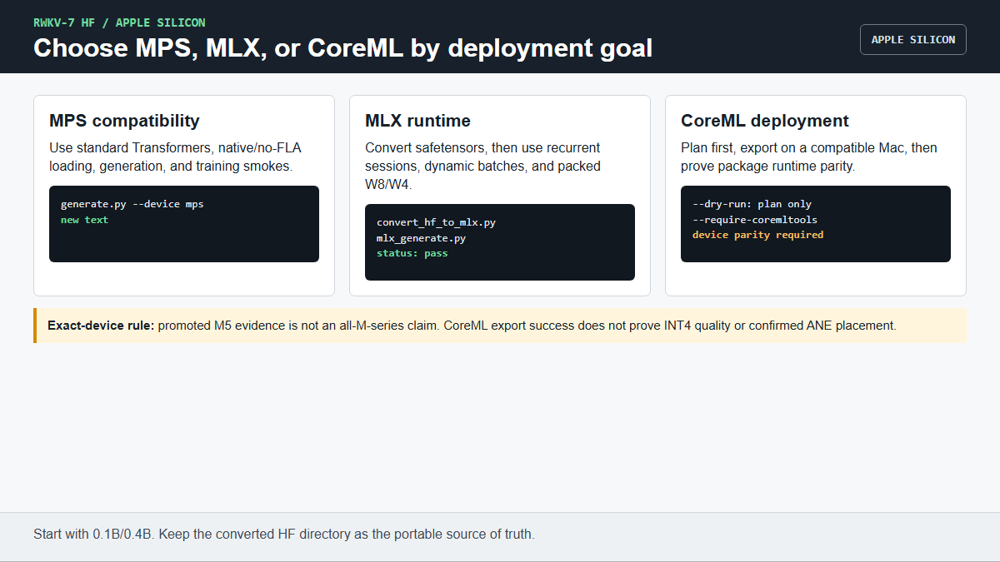

# Apple Silicon tutorial: MPS, MLX, and CoreML

Apple users can choose three layers:

- **MPS:** standard Transformers API through the native/no-FLA model;
- **MLX:** Apple-native recurrent inference, sessions, dynamic batching, and
  packed W8/W4;
- **CoreML:** deployment export prototype for macOS/iOS runtimes.

Chinese version: [`APPLE_USAGE_ZH.md`](APPLE_USAGE_ZH.md)



Use an Apple Silicon Mac, Python 3.10+, and a checked converted HF model. Start
with 0.1B or 0.4B. Intel Macs are not the MLX target.

## 1. Standard HF generation on MPS

```bash
python -m pip install -e .
python examples/check_environment.py --model MODEL
python examples/generate.py --model MODEL --prompt "Hello" \
  --device mps --backend native --dtype fp16 --max-new-tokens 8
```

The environment check must print `RESULT: READY`; generation must exit 0 and
print new text. If fp16 produces a model-specific issue, retry the smallest
model with `--dtype fp32` and report both results rather than silently changing
precision.

The same route supports PEFT, Trainer, SFT, DPO, and GRPO compatibility smokes:

```bash
python -m pip install -e ".[train]"
python tests/test_hf_training_smoke.py --model MODEL \
  --device mps --train-dtype fp32 --max-steps 1 --backend both
python tests/test_hf_rl_training_smoke.py --model MODEL \
  --device mps --train-dtype fp32 --max-steps 1 --backend both
```

Both commands must end in `PASS`. Apple training rows are compatibility
evidence, not a high-throughput production-training recommendation.

## 2. Convert HF safetensors to an MLX directory

Install MLX and export all tensors plus tokenizer/config metadata:

```bash
python -m pip install -e ".[mlx]"
PYTHONPATH=. python scripts/convert_hf_to_mlx.py MODEL MLX_MODEL \
  --dtype fp16 --copy-metadata --require-mlx
```

The command must exit 0 and the output directory must contain MLX weights plus
copied model/tokenizer metadata. `--max-tensors` and `--include` are diagnostic
export options; do not use a partial export for normal generation.

## 3. MLX text generation and reusable sessions

One-shot generation:

```bash
PYTHONPATH=. python scripts/mlx_generate.py MLX_MODEL \
  --prompt "User: Hello. Assistant:" --max-new-tokens 8 \
  --dtype fp16 --wkv-backend auto --require-mlx
```

The JSON output must have `status: pass`, finite output, generated tokens, and
memory/timing telemetry.

Prefill once and decode in two chunks:

```bash
PYTHONPATH=. python scripts/mlx_session_smoke.py MLX_MODEL \
  --prompt "User: Hello. Assistant:" --step-sizes 4,4 \
  --dtype fp16 --wkv-backend auto --require-mlx
```

The session output must match one-shot greedy tokens/text and preserve
`seen_tokens`.

Interleave two independent sessions:

```bash
PYTHONPATH=. python scripts/mlx_session_batch_smoke.py MLX_MODEL \
  --prompt "User: Alpha. Assistant:" \
  --prompt "User: Beta. Assistant:" \
  --rounds 2,2 --session-backend auto --dtype fp16 --require-mlx
```

Each session must match its one-shot result. For a new backend, compare it to
sequential before promotion:

```bash
PYTHONPATH=. python scripts/mlx_session_batch_smoke.py MLX_MODEL \
  --prompt "User: Alpha. Assistant:" --prompt "User: Beta. Assistant:" \
  --rounds 2,2 --session-backend auto \
  --compare-session-backend sequential --require-session-backend-match \
  --dtype fp16 --require-mlx
```

## 4. Packed MLX W8/W4

W8:

```bash
PYTHONPATH=. python scripts/mlx_generate.py MLX_MODEL --prompt "Hello" \
  --max-new-tokens 8 --dtype fp16 --quantization mm8 \
  --quant-backend auto --wkv-backend auto --require-mlx
```

W4:

```bash
PYTHONPATH=. python scripts/mlx_generate.py MLX_MODEL --prompt "Hello" \
  --max-new-tokens 8 --dtype fp16 --quantization mm4 \
  --quant-backend auto --quant-profile uniform --quant-group-size 64 \
  --wkv-backend auto --require-mlx
```

Run the same prompt/dtype once with `--quantization none`. Accept a memory
claim only when the quantized peak is lower and greedy/logit quality passes;
accept a speed claim only with paired same-shape timing. The promoted M5 rows
are described in [`hardware/APPLE_PRODUCTION_CLOSE.md`](hardware/APPLE_PRODUCTION_CLOSE.md).
They do not establish all-M-series or all-shape performance.

## 5. Dynamic batching and prefix-state cache

Run the real-model acceptance harness:

```bash
PYTHONPATH=. python scripts/mlx_dynamic_serving_bench.py \
  --models MLX_MODEL --dtype fp16 --quantization mm4 \
  --quant-backend auto --wkv-backend auto --max-batch-size 4 \
  --results apple-dynamic.jsonl --fail-on-gate
```

The command must exit 0, write passing rows, preserve per-request greedy
results, and report cache/batch telemetry. It validates recurrent state
selection, ragged batching, and bounded prefix cache for the tested workload;
HTTP serving and request admission are outside this script.

## 6. MLX speculative verification

The MLX runtime provides single- and batched-greedy target/draft verification.
Before a real draft experiment, run the same-model/rejection correctness suite:

```bash
PYTHONPATH=. python -m pytest tests/test_mlx_speculative.py -q
```

On an MLX/Metal machine the tests must execute, preserve exact target greedy
tokens through accept and replay paths, and pass. A smaller draft is useful only
when paired timing including draft prefill beats target-only generation.

## 7. CoreML plan and export

Create and inspect a deployment plan without requiring CoreMLTools:

```bash
PYTHONPATH=. python scripts/export_rwkv7_coreml.py MODEL coreml-plan \
  --export-kind stateful-plan --state-mode wkv-coreml \
  --deployment-target macOS15 --quantization none --dry-run
```

The command must exit 0 and write a manifest/plan. A dry run is not a usable
CoreML package.

On a compatible Mac with CoreMLTools installed, request a real stateful export:

```bash
python -m pip install coremltools
PYTHONPATH=. python scripts/export_rwkv7_coreml.py MODEL coreml-output \
  --export-kind stateful-multifunction --state-mode wkv-coreml \
  --prefill-seq-length 16 --sample-seq-length 16 \
  --compute-units cpu-and-ne --deployment-target macOS15 \
  --quantization int8 --require-coremltools
```

Require successful package creation and runtime parity on the target device.
INT4 quality and confirmed ANE placement remain open and must not be inferred
from an export-only pass.

## 8. AI execution rule

Tell an AI assistant which layer you want: MPS, MLX, or CoreML. It must confirm
Apple Silicon, available memory, model size, and the existing model paths;
request approval before conversion; run one section; and report exit code,
exact device/runtime, generated/parity evidence, and memory. It must not convert
a dry-run plan into a deployment claim or generalize M5 evidence to another Mac.
