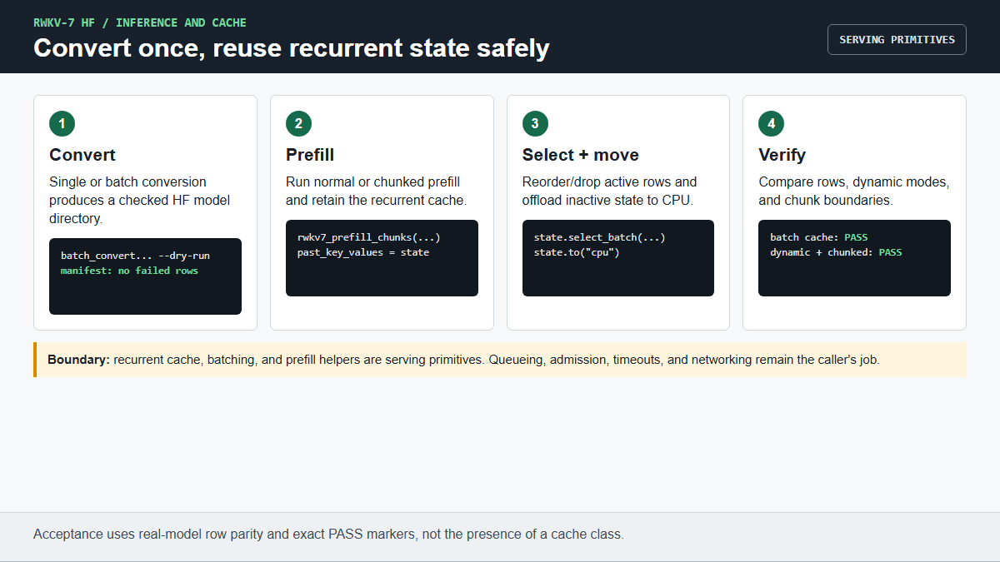

# Inference, conversion, and cache workflows

This tutorial covers the HF adapter capabilities beyond first generation:
repeatable conversion, native/no-FLA execution, loss and masks, model
portability, recurrent-state reuse, dynamic batching, and chunked prefill.

Chinese version: [`INFERENCE_WORKFLOWS_ZH.md`](INFERENCE_WORKFLOWS_ZH.md)

Prerequisite: complete [`USER_GUIDE.md`](USER_GUIDE.md) and replace `MODEL`
below with a checked converted model directory.



## 1. Convert more than one checkpoint

Preview the work and create a SHA256 manifest without loading weights:

```bash
python scripts/batch_convert_rwkv7_to_hf.py \
  --input-dir /path/to/official-pth-files \
  --output-root /path/to/hf-models \
  --vocab-file /path/to/rwkv_vocab_v20230424.txt \
  --precision fp16 --attn-mode fused_recurrent --no-fuse-norm \
  --max-shard-size 5GB --low-memory --dry-run
```

Inspect `/path/to/hf-models/manifest.json`, then remove `--dry-run` to convert.
The command passes when it exits 0, every requested entry is `converted` or an
intentional `skipped`, and no entry is `failed`. `--force` overwrites an
existing output and should only be used deliberately.

For one checkpoint, use `convert_rwkv7_to_hf.py` as shown in the first-run
guide. `--low-memory` lowers host RAM during conversion; it does not lower the
RAM or VRAM required to load the converted model.

Converted directories include a snapshot of the adapter's remote-code files.
After updating this repository, preview and then refresh only that code without
rewriting large weights:

```bash
python scripts/sync_hf_adapter_code.py MODEL --dry-run
python scripts/sync_hf_adapter_code.py MODEL
```

Both commands must exit 0. Back up or version a model directory before
refreshing code that is used in production, then rerun generation and reload
acceptance.

## 2. Select FLA or the portable native backend

Use optimized FLA on a validated Linux NVIDIA environment:

```bash
python examples/generate.py --model MODEL --prompt "Hello" \
  --device cuda --dtype fp16 --backend fla --max-new-tokens 8
```

Use the native/no-FLA backend on CPU, MPS, or CUDA without FLA:

```bash
python examples/generate.py --model MODEL --prompt "Hello" \
  --device cpu --dtype fp32 --backend native --max-new-tokens 8
```

The command passes when it exits 0 and prints newly generated text. Native is
a compatibility route and an optimization host; it is not guaranteed to beat
FLA on every card and shape.

For direct HF API calls, set the environment variable before model loading:

```python
import os
os.environ["RWKV7_NATIVE_MODEL"] = "1"

from transformers import AutoModelForCausalLM

model = AutoModelForCausalLM.from_pretrained(
    "MODEL", trust_remote_code=True
)
```

## 3. Compute causal loss and use attention masks

The adapter accepts ordinary HF token batches, `attention_mask`, and `labels`:

```python
import torch
from transformers import AutoModelForCausalLM, AutoTokenizer

path = "MODEL"
tok = AutoTokenizer.from_pretrained(path, trust_remote_code=True)
model = AutoModelForCausalLM.from_pretrained(
    path, trust_remote_code=True, dtype=torch.float32
).train()
batch = tok(["alpha beta", "gamma"], padding=True, return_tensors="pt")
out = model(
    input_ids=batch["input_ids"],
    attention_mask=batch["attention_mask"],
    labels=batch["input_ids"],
    use_cache=False,
)
assert torch.isfinite(out.loss)
out.loss.backward()
print("PASS", float(out.loss))
```

Use a small model for the first backward pass. Training workflows and their
stronger gates are in [`TRAINING_WORKFLOWS.md`](TRAINING_WORKFLOWS.md).

## 4. Save, reload, and run offline

HF save/reload uses the standard directory contract:

```python
model.save_pretrained("saved-model", safe_serialization=True)
tok.save_pretrained("saved-model")
```

Verify logits survive a save/reload round trip:

```bash
python tests/test_reload_roundtrip.py \
  --model MODEL --device cuda --dtype fp16
```

Success prints `PASS`. After the model is local, block network access during a
normal generation with:

```bash
python examples/generate.py --model saved-model --prompt "Hello" \
  --local-files-only --max-new-tokens 8
```

## 5. Reuse recurrent state

RWKV cache is recurrent state, not a growing Transformer KV cache. Keep the
returned object and pass it to the next token:

```python
with torch.inference_mode():
    prefill = model(**batch, use_cache=True, logits_to_keep=1)
    state = prefill.past_key_values
    next_id = prefill.logits[:, -1:].argmax(dim=-1)
    step = model(
        next_id,
        past_key_values=state,
        use_cache=True,
        logits_to_keep=1,
    )

print(step.past_key_values.rwkv7_cache_metrics())
```

The cache supports `clone()`, `detach()`, `select_batch()`/`batch_select()`,
`reorder_cache()`, `reset()`, and `.to(device=...)`. For example, drop a
finished request and offload an inactive state without modifying the original:

```python
keep = torch.tensor([0, 2], dtype=torch.long, device=next_id.device)
active = state.select_batch(keep, inplace=False)
parked = active.to(device="cpu", inplace=False)
restored = parked.to(device=next_id.device, inplace=False)
```

Verify batch cache and row parity on the real model:

```bash
python tests/test_batch_cache.py --model MODEL --device cuda \
  --dtype fp16 --batch-sizes 1 2 4 --prompt-tokens 64 --decode-steps 8
```

Success prints cache telemetry followed by `PASS`.

## 6. Dynamic batching

Dynamic batching can reorder active rows and remove completed requests while
preserving each request's recurrent state:

```bash
python tests/test_dynamic_batch_cache.py --model MODEL --device cuda \
  --dtype fp16 --batch-size 3 --prompt-tokens 64 --decode-steps 4 \
  --modes forward fast_token
```

Both modes must print their own `PASS`, followed by a final `PASS`. This proves
cache select/reorder/drop semantics for the tested shape; queueing, admission,
timeouts, and network serving remain the caller's responsibility.

## 7. Chunk a long prefill

The model helper carries recurrent state between prompt chunks and keeps only
the needed logits:

```python
with torch.inference_mode():
    out = model.rwkv7_prefill_chunks(
        batch["input_ids"],
        attention_mask=batch.get("attention_mask"),
        chunk_size=256,
        logits_to_keep=1,
    )
```

Compare chunked and ordinary prefill before deploying a new model/card:

```bash
python tests/test_chunked_prefill.py --model MODEL --device cuda \
  --dtype fp16 --batch-size 2 --chunk-sizes 1 2 4 8
```

Success prints per-chunk differences and `PASS`. Choose a production chunk size
with card-local memory and throughput measurements; the smoke defaults are
correctness probes, not tuning recommendations.

## 8. AI execution rule

Tell an AI assistant to read this page and run exactly one numbered section.
It must inspect the device first, substitute an existing checked `MODEL`, quote
the final command, stop on a non-zero exit, and report the documented pass
marker. It must not claim that cache primitives are a production server or
that a smoke row is a performance result.

## Full HF API contract gate

Before publishing a newly converted or refreshed model directory, run:

```bash
python tests/test_hf_api_contract.py --model MODEL \
  --device cuda --dtype fp16 --attn-mode fused_recurrent
```

Success prints `PASS` after checking fixed-vocabulary behavior, generation
input preparation, recurrent-cache reorder/beam generation, and gradient
checkpointing toggles.
