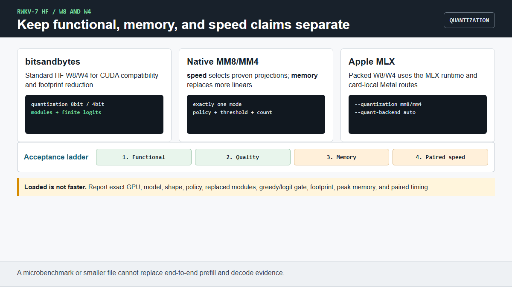

# W8/W4 使用教学

RWKV-7 提供三类量化：标准 HF bitsandbytes、原生 MM8/MM4 和 Apple MLX packed
W8/W4。它们的硬件支持和性能不同。本教程严格区分三个结论：

1. **功能通过**：加载、有限 logits、cache decode 和生成通过；
2. **节省内存**：模型 footprint 小于同一 dense baseline；
3. **速度通过**：在精确显卡和 shape 上，配对端到端时间不慢于 baseline。

English version: [`QUANTIZATION_USAGE.md`](QUANTIZATION_USAGE.md)



## 1. 安装并建立 dense baseline

```bash
python -m pip install -e ".[quant]"
python tests/test_quantized_inference.py --model MODEL \
  --device cuda --dtype fp16 --quantization none --max-new-tokens 4
```

保存 JSON 行，其中包含 `model_footprint_mb`、`peak_vram_mb`、生成 token 和
时间遥测。没有匹配 dense 行的量化结果，不能证明更省内存或更快。

## 2. 标准 HF bitsandbytes W8/W4

W8：

```bash
python tests/test_quantized_inference.py --model MODEL \
  --device cuda --dtype fp16 --quantization 8bit --max-new-tokens 4
```

NF4 W4 + double quant：

```bash
python tests/test_quantized_inference.py --model MODEL \
  --device cuda --dtype fp16 --quantization 4bit \
  --bnb-4bit-quant-type nf4 --bnb-4bit-use-double-quant \
  --max-new-tokens 4
```

每条命令都必须输出 `status: pass`、非零量化模块数、有限 logits、生成 token，
最后打印 `PASS`。正式验收不要使用 `--optional`，因为 skip 不等于 pass。

直接 HF API：

```python
import torch
from transformers import AutoModelForCausalLM, BitsAndBytesConfig

qconfig = BitsAndBytesConfig(
    load_in_4bit=True,
    bnb_4bit_quant_type="nf4",
    bnb_4bit_compute_dtype=torch.float16,
    bnb_4bit_use_double_quant=True,
)
model = AutoModelForCausalLM.from_pretrained(
    "MODEL", trust_remote_code=True,
    quantization_config=qconfig, device_map="cuda",
)
```

本仓库中的 bitsandbytes 适合 CUDA 兼容和省显存场景。追求速度时，请使用
同显卡、同模型、同 batch 的 dense fp16 配对结果选择路线。

## 3. bitsandbytes + 原生无 FLA 模型

```bash
RWKV7_NATIVE_MODEL=1 python tests/test_native_bnb_quant_smoke.py \
  --model MODEL --device cuda --dtype fp16 --quantization both
```

8-bit 和 4-bit 都要输出 pass JSON，验证真实量化 Linear、forward/decode/
generate，最后打印 `NATIVE BNB QUANT PASS`。当原生 JIT 没有对应 packed operand
时，native bnb decode 会使用兼容 eager 路径。

## 4. 原生 MM8/MM4

原生量化不依赖 bitsandbytes。在配置中只打开一个模式：

```python
import os
os.environ["RWKV7_NATIVE_MODEL"] = "1"

from transformers import AutoConfig, AutoModelForCausalLM

path = "MODEL"
config = AutoConfig.from_pretrained(path, trust_remote_code=True)
config.use_native_mm8 = True
config.use_native_mm4 = False
config.native_mm8_policy = "speed"       # 或 "memory"
config.native_mm8_min_params = 8_000_000
model = AutoModelForCausalLM.from_pretrained(
    path, trust_remote_code=True, config=config
).eval()
print(model._rwkv7_native_mm_quantization)
print(model._rwkv7_native_mm_replaced_modules)
```

MM4 则设置 `use_native_mm8=False`、`use_native_mm4=True`，并配置
`native_mm4_policy`/`native_mm4_min_params`。MM8 和 MM4 互斥。

- `speed` 保留多数 dense block，只量化选定昂贵投影；省内存较少，但只有这类
  路线可以按精确显卡证据晋升为速度路线。
- `memory` 替换更多 Linear，通常更省内存，但并不保证普遍快于 fp16。

先验证 config round-trip，再验证真实 MM8 持久化：

```bash
python tests/test_native_quant_config.py
python tests/test_native_mm8_persist.py --model MODEL
```

第一条打印 `NATIVE QUANT CONFIG PASS`；第二条打印 `PASS`，并检查重载后的
MM8 模块和 cosine。持久化 config 会在重载时重新打包符合条件的 Linear。

## 5. 如何验收或否决量化路线

必须固定模型、显卡、dtype、batch size、prompt 长度和 decode 长度：

| 门槛 | 必须提供的证据 |
|---|---|
| 功能 | 量化模块真实存在；logits 有限；forward/cache decode/generate 退出 0 |
| 质量 | dense/quant logits 达到声明的 cosine/error 门槛，greedy next token 一致 |
| 内存 | quant `model_footprint_mb` 更低；峰值显存单独报告 |
| 速度 | 配对、预热后的 prefill/decode 端到端时间，不能拿 microbench 替代 |
| 可复现 | 完整 policy、threshold、替换模块数、依赖版本、GPU 和命令 |

先查 [`QUANTIZATION.md`](QUANTIZATION.md) 和
[`HARDWARE_MATRIX.md`](HARDWARE_MATRIX.md) 是否已有精确卡晋升证据。没有匹配
行时，只能写成“本地实验”。

## 6. Apple MLX W8/W4

MLX 使用独立 packed runtime，不使用 bitsandbytes。转换、生成、会话和 M5
证据边界见 [`APPLE_USAGE.md`](APPLE_USAGE.md#4-packed-mlx-w8w4)。

## 7. 交给 AI 执行

需要 AI 协助时，请打开 [`AI_ASSISTED_SETUP.md`](AI_ASSISTED_SETUP.md) 并选择
“量化验收”。AI 会返回完整命令、退出码和验收结果。
