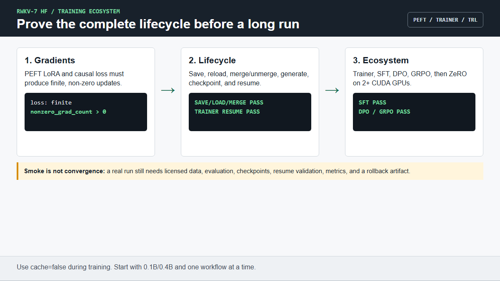

# PEFT, Trainer, and TRL tutorial

This page teaches every currently validated HF training integration. The
commands are intentionally short smokes: they establish interface, gradient,
serialization, and resume behavior before a real dataset consumes hours.

Chinese version: [`TRAINING_WORKFLOWS_ZH.md`](TRAINING_WORKFLOWS_ZH.md)

Prerequisites:

```bash
python -m pip install -e ".[train]"
python examples/check_environment.py --model MODEL
```

Use 0.1B or 0.4B first and replace `MODEL` with a converted model directory.
For training, disable recurrent cache (`use_cache=False`).



## 1. Prove PEFT LoRA gradients

```bash
python tests/test_peft_lora.py --model MODEL \
  --device cuda --attn-mode fused_recurrent
```

Pass conditions are a finite `loss`, `nonzero_grad_count > 0`, and exit code
0. The smoke targets `r_proj`, `k_proj`, `v_proj`, `o_proj`, `key`, and
`value`. Review target modules for a real experiment instead of copying them
without considering trainable size and task.

## 2. Save, load, and merge a LoRA adapter

The native/no-FLA round-trip test trains a tiny adapter, saves it, loads it onto
a fresh base model, checks reversible merge/unmerge, runs `merge_and_unload`,
and compares logits and greedy tokens:

```bash
python tests/test_native_peft_save_load_merge.py \
  --model MODEL --device cuda --dtype fp32 --steps 2
```

Success prints `NATIVE PEFT SAVE/LOAD/MERGE PASS`. This proves serialization
and functional parity for the tested model; it does not evaluate the adapter's
task quality.

The ordinary PEFT deployment pattern is:

```python
from peft import PeftModel
from transformers import AutoModelForCausalLM

base = AutoModelForCausalLM.from_pretrained("MODEL", trust_remote_code=True)
tuned = PeftModel.from_pretrained(base, "ADAPTER_DIR").eval()
merged = tuned.merge_and_unload()
merged.save_pretrained("MERGED_DIR", safe_serialization=True)
```

Keep the unmerged adapter when you need to switch adapters or continue
training. A merged directory is convenient for fixed inference deployment.

## 3. HF Trainer and TRL SFT

Run both standard Trainer and `SFTTrainer` on fixed tiny text:

```bash
python tests/test_hf_training_smoke.py --model MODEL \
  --device cuda --train-dtype bf16 --max-steps 1 --batch-size 1 \
  --gradient-accumulation-steps 1 --max-length 64 --backend both
```

Success produces JSON rows with `status: pass`, finite training loss, a
positive trainable-parameter delta, and a final `PASS`. On hardware without
bf16 support, use `--train-dtype fp32` for the first compatibility run.

To isolate the native/no-FLA SFT path:

```bash
python tests/test_native_sft_smoke.py --model MODEL \
  --device cuda --dtype fp32 --max-steps 2 --batch-size 1 --max-length 48
```

Success prints `NATIVE SFT PASS`.

## 4. Resume a Trainer checkpoint

```bash
python tests/test_native_trainer_resume_smoke.py --model MODEL \
  --device cuda --dtype fp32 --first-steps 2 --resume-steps 3 \
  --batch-size 2 --length 32
```

Success prints `NATIVE TRAINER RESUME PASS`; both phases must update trainable
parameters and the final global step must equal `--resume-steps`.

This portable smoke intentionally validates model/adapter and Trainer-state
continuity. It does not claim complete optimizer, scheduler, RNG, dataloader,
or distributed resume fidelity for every library version. Preserve and verify
those states explicitly in a real run.

## 5. TRL DPO and GRPO

Run the standard HF adapter paths together:

```bash
python tests/test_hf_rl_training_smoke.py --model MODEL \
  --device cuda --train-dtype bf16 --max-steps 1 --batch-size 2 \
  --gradient-accumulation-steps 1 --max-length 64 --backend both
```

The command passes when DPO and GRPO each emit a `status: pass` JSON row with
finite loss and parameter updates, followed by `PASS`.

Focused native/no-FLA commands are:

```bash
python tests/test_native_dpo_smoke.py --model MODEL \
  --dtype fp32 --max-steps 3 --batch-size 2 --max-length 48

python tests/test_native_grpo_smoke.py --model MODEL \
  --dtype fp32 --max-steps 2 --batch-size 2 --max-completion-length 8
```

They must print `NATIVE DPO PASS` and `NATIVE GRPO PASS`. The included prompts,
preference pairs, and reward function are deterministic test fixtures. Replace
them with a reviewed task dataset and evaluation plan for real alignment work.

## 6. Run a repeatable training matrix

On Linux/WSL2, execute PEFT, Trainer/SFT, and DPO/GRPO for one or more models:

```bash
DEVICE=cuda TRAIN_DTYPE=bf16 RESULTS=bench/results.jsonl \
  bash scripts/run_hf_training_matrix.sh MODEL_A MODEL_B
```

Set `RUN_RESUME=1` to add checkpoint resume. Set `RUN_DEEPSPEED=1` only when
2+ CUDA GPUs and DeepSpeed are available. The complete ZeRO-2/3 command and its
boundary are in [`ADVANCED_USAGE.md`](ADVANCED_USAGE.md#4-multi-gpu-training-with-deepspeed-zero).

## 7. Move from smoke to a real fine-tune

Do not start a long run until all of the following are explicit:

- immutable base checkpoint, tokenizer, adapter config, code revision, and
  dependency lock;
- licensed dataset, train/evaluation split, formatting and truncation policy;
- sequence length, microbatch, gradient accumulation, learning rate, schedule,
  precision, seed, and checkpoint cadence;
- held-out quality metrics plus loss, throughput, peak-memory, and NaN logs;
- tested save/load and resume procedure on a disposable short run;
- a rollback artifact containing the unmerged adapter and run configuration.

The status/evidence matrix is in [`TRAINING.md`](TRAINING.md). Production
tensor-parallel training is not a completed repository claim.

## 8. AI execution rule

Ask an AI assistant to run only one section at a time. It must report the
trainable parameter count, loss, update/gradient evidence, exact pass marker,
device and dtype. It must call the command a smoke and must not invent dataset
quality, convergence, or speed conclusions.
