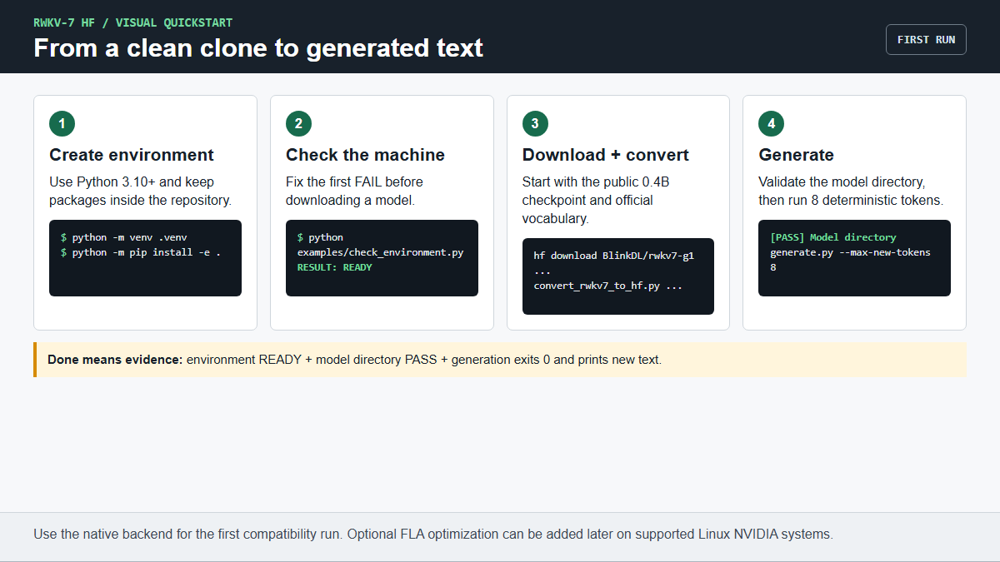

# RWKV-7 HF Adapter 普通用户指南

本文档面向第一次使用命令行、Python 或 Hugging Face 的普通用户。
不需要先读 benchmark、内核或训练文档。英文版见
[`USER_GUIDE.md`](USER_GUIDE.md)。

## 先选入口

- **我自己操作**：继续按本文档从第 1 步执行，不要跳步。
- **让 AI 帮我操作**：把 [`AI_ASSISTED_SETUP.md`](AI_ASSISTED_SETUP.md)
  里的完整提示词发给有终端权限的 Codex、Claude Code、Cursor 等工具。
- **已经有转换好的 HF 模型目录**：直接跳到[第 4 步](#4-生成第一段文本)。
- **第一次生成已经成功**：打开
  [`COMPLETE_ADAPTER_GUIDE_ZH.md`](COMPLETE_ADAPTER_GUIDE_ZH.md)，按总表选择
  缓存、训练、量化、Apple、投机解码或多卡教程。

## 完成标准

只有下面三项都满足，才算安装完成：

1. `python examples/check_environment.py` 显示 `RESULT: READY`。
2. 带 `--model` 再检查时显示 `[PASS] Model directory`。
3. `examples/generate.py` 退出码为 0，并真正打印出新文本。

文件存在不等于模型能运行。遇到错误时只处理屏幕上的第一个 `FAIL` 或
第一段 traceback，然后重新执行同一条命令。



## 新手选择规则

- 第一次只用 **0.4B**。不要用 7.2B 或 13.3B 验证环境。
- Windows、macOS、CPU 用户先安装基础版并使用 `native` 后端。
- Linux + NVIDIA 用户可以安装 CUDA/FLA 优化版；安装失败时先退回基础版。
- 全程使用仓库里的 `.venv`，不要把依赖安装到系统 Python。
- fp16 权重大约占用每参数 2 字节，运行时还需要额外 RAM/VRAM。
- 本文使用公开文件，不需要填写 Hugging Face token。

## 1. 安装

先确认 Python。输出必须是 `3.10` 或更高版本：

```bash
python --version
```

如果提示找不到 `python`，先从 [python.org](https://www.python.org/downloads/)
安装 Python，并在 Windows 安装器中勾选 **Add Python to PATH**，然后关闭并
重新打开终端。

```bash
git clone https://github.com/rwkv-rs/hf-adapter.git
cd hf-adapter
python -m venv .venv
```

Linux/macOS 激活环境：

```bash
source .venv/bin/activate
```

Windows PowerShell 激活环境：

```powershell
.\.venv\Scripts\Activate.ps1
```

如果 PowerShell 提示禁止运行脚本，只对当前窗口临时放行后再激活：

```powershell
Set-ExecutionPolicy -Scope Process -ExecutionPolicy Bypass
.\.venv\Scripts\Activate.ps1
```

先安装基础版。它适用于 Windows、CPU、macOS，也可在 CUDA 上使用 native
后端完成首次验证：

```bash
python -m pip install -U pip
python -m pip install -e .
python examples/check_environment.py
```

最后一条命令必须显示 `RESULT: READY`。如果出现 `FAIL`，先修复第一项再继续。

只有 Linux + NVIDIA 用户需要尝试优化 CUDA/FLA 安装：

```bash
python -m pip install -e ".[cuda]"
```

FLA 安装失败不会阻止使用：重新运行 `python -m pip install -e .`，后续生成
命令增加 `--backend native`。

训练、量化、Apple MLX 是首次生成之后的可选项，不要一次全部安装：

```bash
python -m pip install -e ".[train]"
python -m pip install -e ".[quant]"
python -m pip install -e ".[mlx]"
```

## 2. 下载并转换模型

官方权重位于
[`BlinkDL/rwkv7-g1`](https://huggingface.co/BlinkDL/rwkv7-g1)。首次验证固定使用
`rwkv7-g1d-0.4b-20260210-ctx8192.pth`，不要自行替换文件名。

先安装下载命令：

```bash
python -m pip install -U huggingface_hub
```

### Windows PowerShell

下面每一段可以整段粘贴。先下载模型：

```powershell
New-Item -ItemType Directory -Force models\source
hf download BlinkDL/rwkv7-g1 rwkv7-g1d-0.4b-20260210-ctx8192.pth --local-dir models\source
```

再下载词表：

```powershell
Invoke-WebRequest -Uri "https://raw.githubusercontent.com/BlinkDL/RWKV-LM/main/RWKV-v7/rwkv_vocab_v20230424.txt" -OutFile "models\source\rwkv_vocab_v20230424.txt"
```

转换模型：

```powershell
python scripts\convert_rwkv7_to_hf.py `
  --input models\source\rwkv7-g1d-0.4b-20260210-ctx8192.pth `
  --output models\rwkv7-g1d-0.4b-hf `
  --vocab-file models\source\rwkv_vocab_v20230424.txt `
  --precision fp16 `
  --attn-mode fused_recurrent `
  --no-fuse-norm
```

### Linux 或 macOS

下载模型和词表：

```bash
mkdir -p models/source
hf download BlinkDL/rwkv7-g1 \
  rwkv7-g1d-0.4b-20260210-ctx8192.pth \
  --local-dir models/source
curl -L \
  https://raw.githubusercontent.com/BlinkDL/RWKV-LM/main/RWKV-v7/rwkv_vocab_v20230424.txt \
  -o models/source/rwkv_vocab_v20230424.txt
```

转换模型：

```bash
python scripts/convert_rwkv7_to_hf.py \
  --input models/source/rwkv7-g1d-0.4b-20260210-ctx8192.pth \
  --output models/rwkv7-g1d-0.4b-hf \
  --vocab-file models/source/rwkv_vocab_v20230424.txt \
  --precision fp16 \
  --attn-mode fused_recurrent \
  --no-fuse-norm
```

## 3. 检查转换结果

Windows、Linux 和 macOS 都执行：

```bash
python examples/check_environment.py --model models/rwkv7-g1d-0.4b-hf
```

必须同时看到 `RESULT: READY` 和 `[PASS] Model directory`，否则不要继续。
转换目录至少应包含 `config.json`、`tokenizer_config.json`、
`rwkv_vocab_v20230424.txt` 和一个或多个 `.safetensors` 权重文件。

7.2B、13.3B 等大模型转换时增加：

```text
--low-memory --max-shard-size 5GB
```

`--low-memory` 只降低转换时的内存，不会降低推理显存。

## 4. 生成第一段文本

默认会自动选择 CUDA、MPS 或 CPU；CUDA 已安装 FLA 时自动使用 FLA，
否则自动使用 native 后端：

Windows PowerShell：

```powershell
python examples\generate.py --model models\rwkv7-g1d-0.4b-hf --prompt "User: 你好，请用一句话介绍自己。 Assistant:" --max-new-tokens 8
```

Linux 或 macOS：

```bash
python examples/generate.py \
  --model models/rwkv7-g1d-0.4b-hf \
  --prompt "User: 你好，请用一句话介绍自己。 Assistant:" \
  --max-new-tokens 8
```

终端先显示加载的设备、精度和后端，然后打印模型生成的新文本。只要命令退出码为
0 且有新文本，首次安装就完成了。内容质量取决于 checkpoint，本步骤只验证运行链路。

常用配置：

```bash
# NVIDIA CUDA + FLA。
python examples/generate.py --model /path/to/model-hf \
  --prompt "你好" --device cuda --backend fla --dtype fp16

# CPU。建议只先试小模型。
python examples/generate.py --model /path/to/model-hf \
  --prompt "你好" --device cpu --backend native --dtype fp32

# Apple MPS。
python examples/generate.py --model /path/to/model-hf \
  --prompt "你好" --device mps --backend native --dtype fp16

# 开启采样。
python examples/generate.py --model /path/to/model-hf \
  --prompt "从前有一座山" --temperature 0.8 --top-p 0.9
```

查看全部参数：

```bash
python examples/generate.py --help
```

## 5. Python API

```python
import importlib.util
import os
import torch
from transformers import AutoModelForCausalLM, AutoTokenizer

model_path = "models/rwkv7-g1d-0.4b-hf"
device = torch.device("cuda" if torch.cuda.is_available() else "cpu")
dtype = torch.float16 if device.type == "cuda" else torch.float32

# CPU、MPS 或没有安装 FLA 的 CUDA 环境使用 native 后端。
if device.type != "cuda" or importlib.util.find_spec("fla") is None:
    os.environ["RWKV7_NATIVE_MODEL"] = "1"

tokenizer = AutoTokenizer.from_pretrained(model_path, trust_remote_code=True)
model = AutoModelForCausalLM.from_pretrained(
    model_path,
    trust_remote_code=True,
    dtype=dtype,
).eval().to(device)

inputs = tokenizer("User: 你好！\n\nAssistant:", return_tensors="pt")
inputs = {name: tensor.to(device) for name, tensor in inputs.items()}

with torch.inference_mode():
    output = model.generate(
        **inputs,
        max_new_tokens=64,
        do_sample=False,
        use_cache=True,
        pad_token_id=tokenizer.pad_token_id,
    )

new_tokens = output[0, inputs["input_ids"].shape[1]:]
print(tokenizer.decode(new_tokens, skip_special_tokens=True))
```

转换后的模型目录包含 remote-code 适配文件，因此必须设置
`trust_remote_code=True`。只对可信的本地目录或 Hugging Face 仓库使用该选项。

## 6. 让 AI 使用

如果你希望 AI 编程助手代替你安装、下载、转换并验证，请不要只说“帮我装一下”。
打开仓库后，把 [`AI_ASSISTED_SETUP.md`](AI_ASSISTED_SETUP.md) 中的完整提示词
原样发给它。该提示词要求 AI：

- 先实际检查系统、Python、磁盘和 GPU，不允许猜测；
- 下载大文件前说明目标并请求确认；
- 每一步检查退出码，失败时只处理第一个真实错误；
- 不运行 benchmark、训练或量化任务；
- 最后给出真实生成文本和全部验收结果。

如果你是在自己的 AI 应用中调用 RWKV-7，请使用上一节的 Transformers API，
保留 `use_cache=True`。本仓库提供模型适配器，不提供托管聊天服务；你的应用仍需
管理提示模板、对话历史、请求限流和模型进程。

## 常见问题

- **提示缺少 `fla`**：增加 `--backend native`，或者在支持的 Linux CUDA
  环境安装 `.[cuda]`。
- **CUDA 不可用**：运行
  `python -c "import torch; print(torch.cuda.is_available())"` 检查 PyTorch。
- **显存不足**：先换小模型。量化可以省显存，但不同显卡的速度和支持情况
  不同，请阅读 [`QUANTIZATION.md`](QUANTIZATION.md)。
- **第一次运行很慢**：CUDA/Triton 内核可能需要首次编译和预热。
- **输出不像聊天模型**：适配器不会改变模型训练性质。基础模型并不会因为接入 HF
  自动变成指令模型，请选择合适的 checkpoint 和提示格式。
- **Windows CUDA/FLA 安装困难**：先使用基础安装和 native 后端；优化后端主要在
  Linux 上验证，也可以考虑 WSL2。
- **不知道把错误发给别人时该发什么**：运行
  `python examples/check_environment.py`，提供该命令输出、失败命令和第一段完整
  traceback。不要发送密码、token 或 SSH 私钥。

更多图文流程：投机解码、训练和多卡使用见
[`ADVANCED_USAGE_ZH.md`](ADVANCED_USAGE_ZH.md)。训练状态见
[`TRAINING.md`](TRAINING.md)，硬件支持见
[`HARDWARE_MATRIX.md`](HARDWARE_MATRIX.md)，性能后端见
[`PERFORMANCE.md`](PERFORMANCE.md)。
