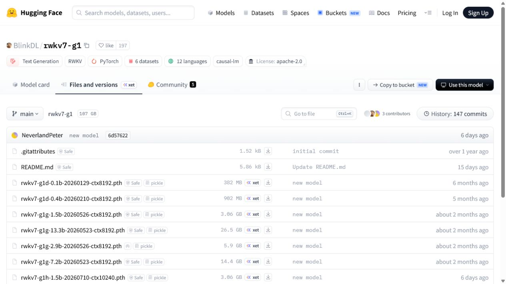
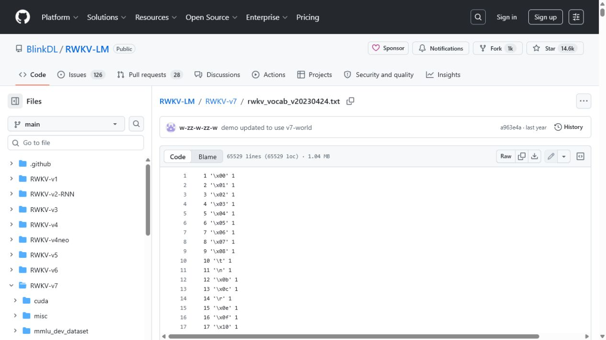

# RWKV-7 HF Adapter 普通用户指南

本文档面向第一次使用命令行、Python 或 Hugging Face 的普通用户。
不需要先读 benchmark、内核或训练文档。英文版见
[`USER_GUIDE.md`](USER_GUIDE.md)。

## 先选入口

- **普通用户首次运行**：完成[第 1 步](#1-安装)，直接验收公开 0.1B 模型；不需要
  clone 仓库，也不需要转换 `.pth`。
- **接入 Python 项目**：smoke 通过后跳到 [Python API](#5-python-api)。
- **新 checkpoint 或定制权重**：使用可选的
  [转换流程](#2-可选下载并转换模型)。
- **让 AI 帮忙**：把 [`AI_ASSISTED_SETUP.md`](AI_ASSISTED_SETUP.md) 发给有
  终端权限的助手。
- **训练、量化、Apple、多卡等高级任务**：首次生成成功后从
  [`COMPLETE_ADAPTER_GUIDE.md`](COMPLETE_ADAPTER_GUIDE.md) 选择一个流程。

## 完成标准

普通用户只有下面三项都满足才算安装完成：

1. `rwkv7-hf doctor` 显示 `RESULT: READY`；
2. `rwkv7-hf smoke` 显示 `RESULT: PASS` 并写出合法 JSON；
3. 报告中的 `rwkv7_hf` 为 `0.8.1`，且确实生成了新 token。

自行转换与源码开发还有模型目录、转换 manifest 和仓库测试门槛。文件存在、命令已
启动或“理论上可用”都不算通过。

## 新手选择规则

- 第一次固定使用公开 **0.1B**，不要用 7.2B/13.3B 排查安装。
- Windows、macOS、CPU 和没有预编译 wheel 的 GPU 都可使用基础包。
- Linux NVIDIA 只有在精确匹配时才安装预编译 wheel，不要强装相近版本。
- 使用独立 `.venv`，不要把依赖安装到系统 Python。
- 普通推理不需要 FLA，也不需要 Hugging Face token。
- fp16 权重约占每参数 2 字节，运行时还要为状态和临时缓冲预留空间。

## 1. 安装

先确认 Python 为 3.10 或更高版本，然后创建独立环境：

```bash
python --version
python -m venv .venv
source .venv/bin/activate                 # Windows：.venv\Scripts\Activate.ps1
python -m pip install -U pip
python -m pip install "rwkv7-hf==0.8.1"
```

Windows PowerShell 如果禁止激活脚本，只对当前窗口临时放行：

```powershell
Set-ExecutionPolicy -Scope Process -ExecutionPolicy Bypass
.\.venv\Scripts\Activate.ps1
```

不下载模型，先检查安装和自动路由候选：

```bash
rwkv7-hf doctor
rwkv7-hf kernels status
rwkv7-hf kernels recommend
```

Doctor 必须显示 `RESULT: READY`。Linux NVIDIA 只有在推荐命令列出一个完全匹配
wheel 时才继续：

```bash
rwkv7-hf kernels install
rwkv7-hf doctor
```

安装器会同时检查 Python ABI、系统与机器架构、PyTorch 主次版本和 C++ ABI、
CUDA runtime、GPU compute capability 以及 adapter 版本。`pip install rwkv7-hf`
本身不会猜测或静默安装 GPU 二进制。运行时默认 `auto` 会依次选择：

```text
兼容的预编译算子 → 允许时按需 JIT → Triton/tensor/PyTorch 正确回退
```

因此没有匹配 wheel 也不影响基础 adapter 使用。详细矩阵见
[预编译 CUDA 算子 wheel](KERNEL_WHEELS_ZH.md)。

现在运行公开 0.1B 一键验收：

```bash
rwkv7-hf smoke \
  --model wangyue114514/rwkv7-g1d-0.1b-hf \
  --revision v0.7.0 \
  --device auto \
  --output rwkv7-smoke.json
```

第一次会自动下载模型。`RESULT: PASS` 表示加载、Prefill、贪心 Decode、有限
logits 和实际运行路线报告全部完成；其中时间只用于安装 smoke，不是通用性能结论。

后续任务需要时再安装对应 PyPI extra，不要一次全部安装：

```bash
python -m pip install "rwkv7-hf[cuda]==0.8.1"    # Linux NVIDIA JIT 工具
python -m pip install "rwkv7-hf[train]==0.8.1"   # PEFT/TRL/DeepSpeed
python -m pip install "rwkv7-hf[quant]==0.8.1"   # bitsandbytes
python -m pip install "rwkv7-hf[mlx]==0.8.1"     # Apple Silicon MLX
```

## 2. 可选：下载并转换模型

单 checkpoint 转换器已经包含在 `rwkv7-hf==0.8.1`，可从任意目录运行，不需要
克隆源码：

```bash
rwkv7-hf convert --help
```

官方权重位于
[`BlinkDL/rwkv7-g1`](https://huggingface.co/BlinkDL/rwkv7-g1)。首次验证固定使用
`rwkv7-g1d-0.4b-20260210-ctx8192.pth`，不要自行替换文件名。

打开网页后先切到 **Files and versions**。只下载下面截图中约 **902 MB** 的
`rwkv7-g1d-0.4b-20260210-ctx8192.pth`；不要点页面顶部下载整个约 107 GB 的
仓库，也不要第一次就选 7.2B/13.3B。



推荐使用下面的 `hf download` 命令，因为下载中断后再次执行同一命令可以复用
缓存继续。必须使用浏览器时，点击准确文件名右侧的下载图标，下载完成后把文件
移动到 `models/source/`。第一次运行建议至少预留 **3 GB** 磁盘，容纳源权重、
转换后的 fp16 权重和临时文件。

先安装下载命令：

```bash
python -m pip install -U huggingface_hub
```

词表来自官方 RWKV-LM 仓库的
[`rwkv_vocab_v20230424.txt`](https://github.com/BlinkDL/RWKV-LM/blob/main/RWKV-v7/rwkv_vocab_v20230424.txt)。
网页下载时点击文件内容上方的 **Raw** 或它旁边的下载按钮，不要把 GitHub HTML
页面另存为 `.txt`。



### Windows PowerShell

下面每一段可以整段粘贴。先下载模型：

```powershell
New-Item -ItemType Directory -Force models\source
hf download BlinkDL/rwkv7-g1 rwkv7-g1d-0.4b-20260210-ctx8192.pth --local-dir models\source
```

再下载词表：

```powershell
Invoke-WebRequest -Uri "https://raw.githubusercontent.com/BlinkDL/RWKV-LM/main/RWKV-v7/rwkv_vocab_v20230424.txt" -OutFile "models\source\rwkv_vocab_v20230424.txt"
```

下载后先确认两个文件都在正确目录，而且大小不是 0：

```powershell
Get-Item models\source\rwkv7-g1d-0.4b-20260210-ctx8192.pth, models\source\rwkv_vocab_v20230424.txt | Select-Object FullName, Length
```

转换模型：

```powershell
rwkv7-hf convert `
  --input models\source\rwkv7-g1d-0.4b-20260210-ctx8192.pth `
  --output models\rwkv7-g1d-0.4b-hf `
  --vocab-file models\source\rwkv_vocab_v20230424.txt `
  --precision fp16 `
  --attn-mode fused_recurrent `
  --adapter-layout thin `
  --no-fuse-norm
```

### Linux 或 macOS

下载模型和词表：

```bash
mkdir -p models/source
hf download BlinkDL/rwkv7-g1 \
  rwkv7-g1d-0.4b-20260210-ctx8192.pth \
  --local-dir models/source
curl -L \
  https://raw.githubusercontent.com/BlinkDL/RWKV-LM/main/RWKV-v7/rwkv_vocab_v20230424.txt \
  -o models/source/rwkv_vocab_v20230424.txt
```

下载后检查文件：

```bash
ls -lh \
  models/source/rwkv7-g1d-0.4b-20260210-ctx8192.pth \
  models/source/rwkv_vocab_v20230424.txt
```

转换模型：

```bash
rwkv7-hf convert \
  --input models/source/rwkv7-g1d-0.4b-20260210-ctx8192.pth \
  --output models/rwkv7-g1d-0.4b-hf \
  --vocab-file models/source/rwkv_vocab_v20230424.txt \
  --precision fp16 \
  --attn-mode fused_recurrent \
  --adapter-layout thin \
  --no-fuse-norm
```

`thin` 是默认布局，与六个公开 Hub 模型一致：输出目录只放三个很小的 remote-code
入口，实际实现来自已安装的 `rwkv7-hf`。只有离线或归档目录必须自带完整运行时代码
快照时才使用 `--adapter-layout bundled`；两种布局的模型权重完全相同。

下载中断时重新执行同一条 `hf download`，不要创建第二个文件名。浏览器下载如果
出现 `.crdownload`、`.part` 或大小持续变化，说明还没完成；不要提前转换。转换
失败时保留 `models/source/`，先删除或改名不完整的 HF **输出目录**，修复第一处
错误后重新运行转换命令。不要删除已经完成的源权重。

## 3. 检查转换结果

Windows、Linux 和 macOS 都执行：

```bash
rwkv7-hf doctor
rwkv7-hf smoke --model models/rwkv7-g1d-0.4b-hf --device auto
```

两条命令必须分别看到 `RESULT: READY` 和 `RESULT: PASS`，否则不要继续。
转换目录至少应包含 `config.json`、`tokenizer_config.json`、
`rwkv_vocab_v20230424.txt` 和一个或多个 `.safetensors` 权重文件。

7.2B、13.3B 等大模型转换时增加：

```text
--low-memory --max-shard-size 5GB
```

`--low-memory` 只降低转换时的内存，不会降低推理显存。

## 4. 生成第一段文本

已安装的 smoke 命令会自动选择 CUDA、MPS 或 CPU，并加载 native 后端：

```bash
rwkv7-hf smoke --model models/rwkv7-g1d-0.4b-hf --device auto
```

看到 `RESULT: PASS` 才表示加载、Prefill 和 Decode 链路通过。需要自定义提示词、
采样或集成应用时，使用下一节标准 Transformers Python API。下面的
`examples/generate.py` 仅存在于源码仓库，是可选的开发者示例：

常用配置：

```bash
# NVIDIA CUDA + 原生融合 kernel。
python examples/generate.py --model /path/to/model-hf \
  --prompt "你好" --device cuda --backend native --dtype fp16

# CPU。建议只先试小模型。
python examples/generate.py --model /path/to/model-hf \
  --prompt "你好" --device cpu --backend native --dtype fp32

# Apple MPS。
python examples/generate.py --model /path/to/model-hf \
  --prompt "你好" --device mps --backend native --dtype fp16

# 开启采样。
python examples/generate.py --model /path/to/model-hf \
  --prompt "从前有一座山" --temperature 0.8 --top-p 0.9
```

查看全部参数：

```bash
python examples/generate.py --help
```

## 5. Python API

```python
import torch
from transformers import AutoModelForCausalLM, AutoTokenizer

model_path = "wangyue114514/rwkv7-g1d-0.1b-hf"
device = torch.device("cuda" if torch.cuda.is_available() else "cpu")
dtype = torch.float16 if device.type == "cuda" else torch.float32

tokenizer = AutoTokenizer.from_pretrained(model_path, trust_remote_code=True)
model = AutoModelForCausalLM.from_pretrained(
    model_path,
    trust_remote_code=True,
    dtype=dtype,
).eval().to(device)

inputs = tokenizer("User: 你好！\n\nAssistant:", return_tensors="pt")
inputs = {name: tensor.to(device) for name, tensor in inputs.items()}

with torch.inference_mode():
    output = model.generate(
        **inputs,
        max_new_tokens=64,
        do_sample=False,
        use_cache=True,
        pad_token_id=tokenizer.pad_token_id,
    )

new_tokens = output[0, inputs["input_ids"].shape[1]:]
print(tokenizer.decode(new_tokens, skip_special_tokens=True))
```

公开成品仓库与本地转换目录都包含很小的 remote-code 入口，因此必须设置
`trust_remote_code=True`；实际维护中的实现来自已安装的 `rwkv7-hf`。只对可信的
本地目录或 Hugging Face 仓库使用该选项。

### 公开参数与配置命名

因果语言模型接口使用可检查的 Transformers 风格参数名，包括 `input_ids`、
`attention_mask`、`inputs_embeds`、`past_key_values`、`labels`、`use_cache`、
`output_hidden_states`、`return_dict`、`logits_to_keep`、`position_ids` 和
`cache_position`。可选的 FLA reference 包装器仍保留 `**kwargs`，以兼容不同 Transformers
版本新增的参数。新代码应使用 `logits_to_keep`；已弃用的
`num_logits_to_keep` 仍作为兼容别名保留。

RWKV checkpoint 和 kernel 历史上使用 `num_heads`，而 Transformers 工具通常读取
`num_attention_heads`。原生和 FLA 配置均接受任一名称，并通过两个属性暴露相同值：

```python
from transformers import AutoConfig

config = AutoConfig.from_pretrained(model_path, trust_remote_code=True)
assert config.num_heads == config.num_attention_heads
```

只有 `num_heads` 的旧配置仍然有效；新代码可以使用任一名称，但两个非空值不一致时
会直接报错。配置序列化会同时写出两个字段。内部参数名、state-dict key 和 kernel
中的 RWKV 局部记号不会因此改名。

## 6. 让 AI 使用

安装、推理、缓存、投机解码、训练、多卡、量化和 Apple 流程共用一个入口：
[`AI_ASSISTED_SETUP.md`](AI_ASSISTED_SETUP.md)。从它的任务路由中只选择一个
`TASK_ID`，再复制同一份完整模板。不要从本页或其他专题页拼装另一套提示词。

如果你是在自己的 AI 应用中调用 RWKV-7，请使用上一节的 Transformers API，
保留 `use_cache=True`。本仓库提供模型适配器，不提供托管聊天服务；你的应用仍需
管理提示模板、对话历史、请求限流和模型进程。

## 常见问题

- **旧的本地转换目录提示缺少 `fla`**：在源码仓库中运行
  `python scripts/sync_hf_adapter_code.py /path/to/model-hf` 更新 Auto metadata，
  再使用 native；公开成品模型和普通 0.8.1 推理不需要 FLA。
- **CUDA 不可用**：运行
  `python -c "import torch; print(torch.cuda.is_available())"` 检查 PyTorch。
- **显存不足**：先换小模型。量化可以省显存，但不同显卡的速度和支持情况
  不同，请阅读 [`QUANTIZATION.md`](QUANTIZATION.md)。
- **第一次运行很慢**：运行 `rwkv7-hf kernels recommend`；精确预编译 wheel 可
  避免其中已包含扩展的本地 JIT。CUDA/Triton 和图路线仍可能需要首次预热。
- **输出不像聊天模型**：适配器不会改变模型训练性质。基础模型并不会因为接入 HF
  自动变成指令模型，请选择合适的 checkpoint 和提示格式。
- **Windows CUDA 安装困难**：先使用基础安装和 native 后端；优化后端主要在
  Linux 上验证，也可以考虑 WSL2。
- **不知道把错误发给别人时该发什么**：普通安装运行
  `rwkv7-hf doctor --json --output rwkv7-doctor.json`；源码转换再运行
  `python examples/check_environment.py`。提供失败命令和第一段完整 traceback，
  不要发送密码、token 或 SSH 私钥。

更多图文流程：投机解码、训练和多卡使用见
[`ADVANCED_USAGE_ZH.md`](ADVANCED_USAGE_ZH.md)。训练状态见
[`TRAINING.md`](TRAINING.md)，硬件支持见
[`HARDWARE_MATRIX.md`](HARDWARE_MATRIX.md)，性能后端见
[`PERFORMANCE.md`](PERFORMANCE.md)。
